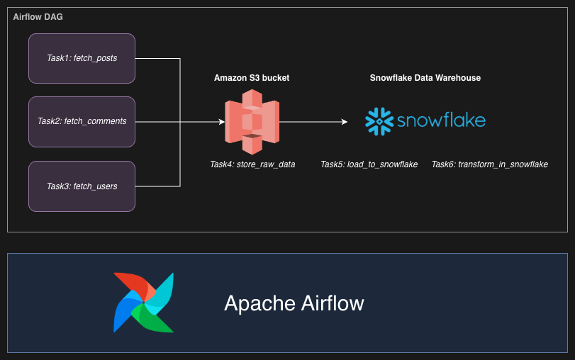
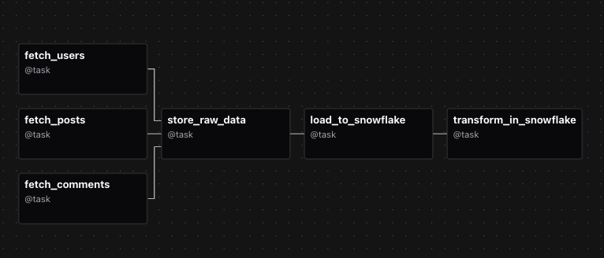
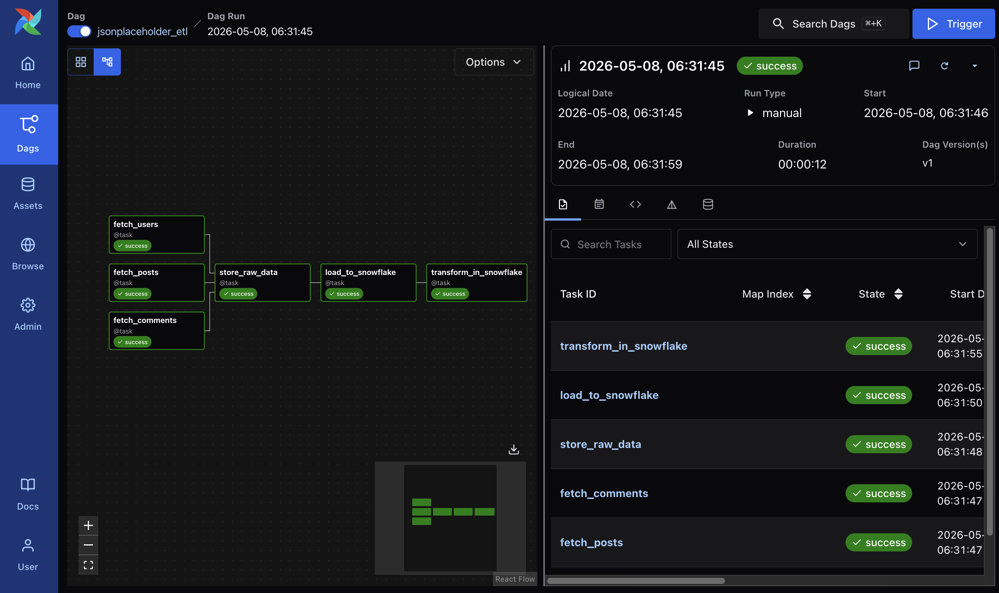
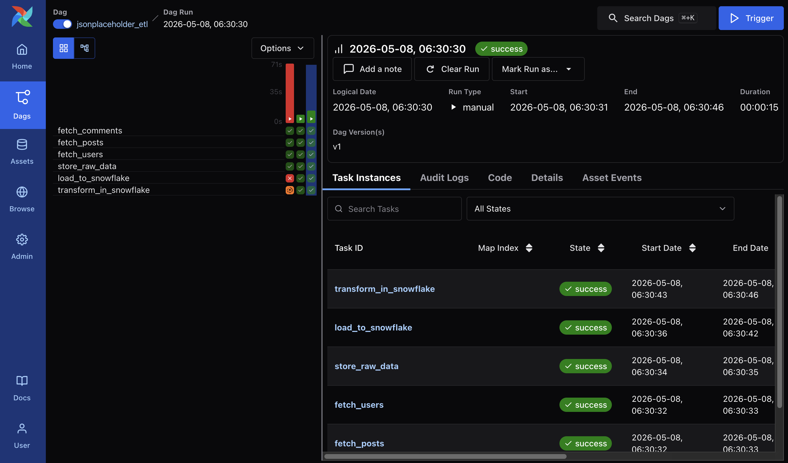
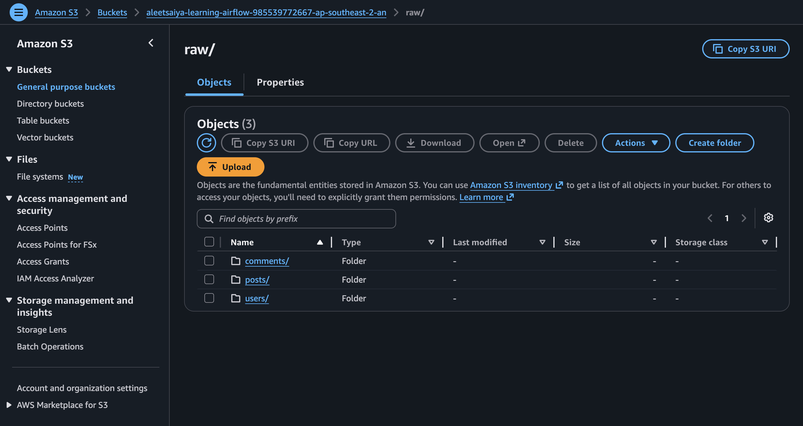
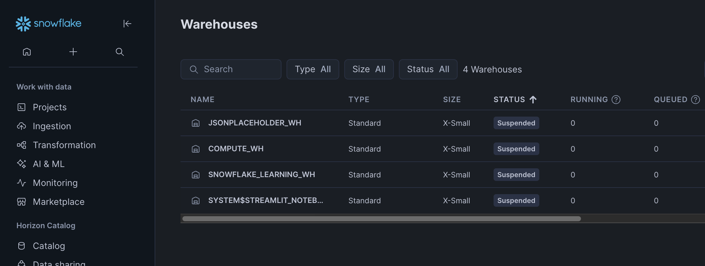
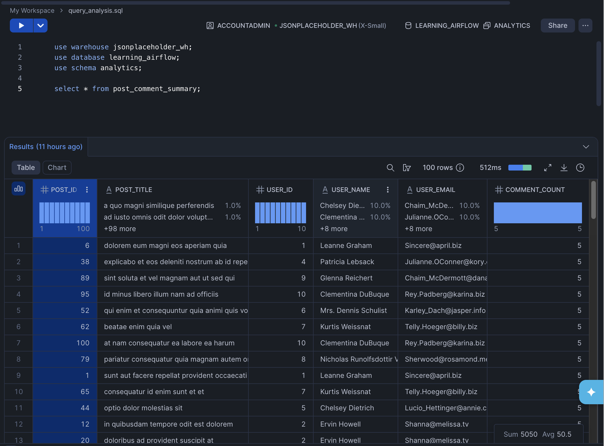
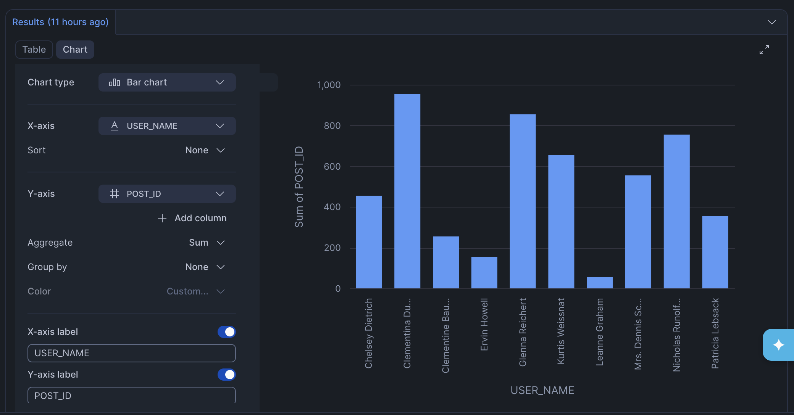

# Airflow Project For Learning Data Integration

This is a simple Apache Airflow project I built to learn how to create DAGs and connect a data pipeline with different services.

The project simulates a real-world data integration workflow. The DAG fetches data from an API, stores raw JSON data in an Amazon S3 bucket, loads that raw data into Snowflake, and then creates an analytics view in Snowflake for further analysis.

The project use [JSONPlaceholder](https://jsonplaceholder.typicode.com/) for data sources.

## Catalog

+ [System Diagram](#system-diagram)
+ [DAG Task Structure](#dag-task-structure)
+ [Task Explanation](#task-explanation)
  + [Tasks 1-3: Fetch Data Sources](#tasks-1-3-fetch-data-sources)
  + [Task 4: Store Raw Data To Amazon S3](#task-4-store-raw-data-to-amazon-s3)
  + [Tasks 5-6: Load And Transform In Snowflake](#tasks-5-6-load-and-transform-in-snowflake)
  + []
+ [Setup Notes](#setup-notes)

## System Diagram



The system starts with three Airflow extraction tasks. These tasks call the JSONPlaceholder API and return posts, comments, and users data. Airflow then stores the raw API response data in Amazon S3, loads the raw JSON files into Snowflake raw tables, and creates a Snowflake analytics view for analysis.

## DAG Task Structure



The first three tasks run in parallel because they fetch independent datasets. After all three source datasets are available, `store_raw_data` stores them in S3. Then `load_to_snowflake` loads the S3 files into Snowflake, and `transform_in_snowflake` creates the analytics view.

The main DAG file is: [`dags/jsonplaceholder_etl.py`](dags/jsonplaceholder_etl.py).

Running result:

<table>
  <tr>
    <td></td>
    <td></td>
  </tr>
</table>

## Task Explanation
### Tasks 1-3: Fetch Data Sources

```python
@task
def fetch_posts() -> list[dict[str, Any]]:
    return _fetch_endpoint("posts")

@task
def fetch_comments() -> list[dict[str, Any]]:
    return _fetch_endpoint("comments")

@task
def fetch_users() -> list[dict[str, Any]]:
    return _fetch_endpoint("users")
```

These tasks use Python `requests.get()` to call:

```text
https://jsonplaceholder.typicode.com/posts
https://jsonplaceholder.typicode.com/comments
https://jsonplaceholder.typicode.com/users
```

Each task returns the full JSON list. In Airflow, returning data from a TaskFlow task stores that output in XCom, so the downstream `store_raw_data` task can receive the datasets as function arguments.

## Task 4: Store Raw Data To Amazon S3

The `store_raw_data` task receives the posts, comments, and users data from XCom and writes each dataset as a raw JSON file in Amazon S3.



*sample object for comment API request:*
```json
[
  {
    "id": 1,
    "body": "laudantium enim quasi est quidem magnam voluptate ipsam eos\ntempora quo necessitatibus\ndolor quam autem quasi\nreiciendis et nam sapiente accusantium",
    "name": "id labore ex et quam laborum",
    "email": "Eliseo@gardner.biz",
    "postId": 1
  },
]
```

To connect Airflow with Amazon S3, this project uses the Amazon provider package:

```text
apache-airflow-providers-amazon
```

This provider gives Airflow access to `S3Hook`, which is the helper class used by the DAG to upload JSON strings to the S3 bucket through the `aws_s3` Airflow connection.

## Tasks 5-6: Load And Transform In Snowflake

In Snowflake, a **database** stores data objects such as schemas, tables, stages, and views. A **warehouse** is the compute resource that runs SQL queries against those objects. For this project, I created a small `XSMALL` warehouse so Snowflake has compute available to run `CREATE`, `COPY INTO`, and `SELECT` statements.



### Task 5: `load_to_snowflake`

To connect Airflow with Snowflake, this project uses the Snowflake provider package:

```text
apache-airflow-providers-snowflake
```

This provider gives Airflow access to `SnowflakeHook`, which is the helper class used by the DAG to send SQL statements to Snowflake through the `snowflake_default` Airflow connection.

This task first checks whether the required Snowflake objects exist and creates them if needed:

1. `RAW` schema: stores the raw loading objects for this pipeline.
2. `RAW.JSON_FORMAT` file format: tells Snowflake how to read the JSON files from S3. `STRIP_OUTER_ARRAY = TRUE` allows Snowflake to load each object inside the JSON array as a separate row.
3. `RAW.JSONPLACEHOLDER_RAW_STAGE` external stage: points Snowflake to the S3 `raw/` folder and provides the AWS credentials Snowflake needs to read the files.
4. `RAW.POSTS`, `RAW.COMMENTS`, and `RAW.USERS` tables: store raw JSON records in a `VARIANT` column, plus metadata such as `source_file` and `loaded_at`.

After creating the stage and tables, the task uses Snowflake `COPY INTO` to load data from S3 into the raw tables.

### Task 6: `transform_in_snowflake`

The `transform_in_snowflake` task runs SQL inside Snowflake to create a view in `ANALYTICS` schema. The view extracts typed fields from the raw JSON `VARIANT` records and joins posts, users, and comments together. It produces columns like:





## Setup Notes

Start Airflow locally with Astro CLI: `astro dev start`

**Setup connection inside local Airflow:**

Amazon S3 connection:

```text
Connection ID: aws_s3
Connection Type: Amazon Web Services
Login: <AWS access key ID>
Password: <AWS secret access key>
```

Extra JSON:

```json
{
  "region_name": "ap-southeast-2"
}
```

Snowflake connection:

```text
Connection ID: snowflake_default
Connection Type: Snowflake
Login: AIRFLOW_USER
Password: <AIRFLOW_USER password>
Schema: RAW
```

Extra JSON:

```json
{
  "account": "<your_snowflake_account_identifier>",
  "warehouse": "JSONPLACEHOLDER_WH",
  "database": "LEARNING_AIRFLOW",
  "role": "AIRFLOW_ROLE"
}
```

The Snowflake `account` value is not the username. For a URL like:

```text
https://app.snowflake.com/<org_name>/<account_name>/...
```

use:

```text
<org_name>-<account_name>
```

**Required `.env` Values**

The DAG reads these environment variables from `.env` inside the Astro containers:

```env
S3_RAW_BUCKET=<your-s3-bucket-name>
AWS_ACCESS_KEY_ID=<AWS access key ID>
AWS_SECRET_ACCESS_KEY=<AWS secret access key>
```

After editing `.env` or recreating connections, restart Astro:

```bash
astro dev restart
```
